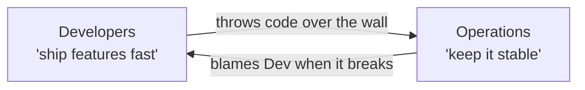
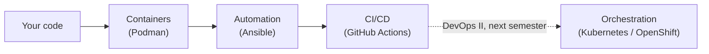
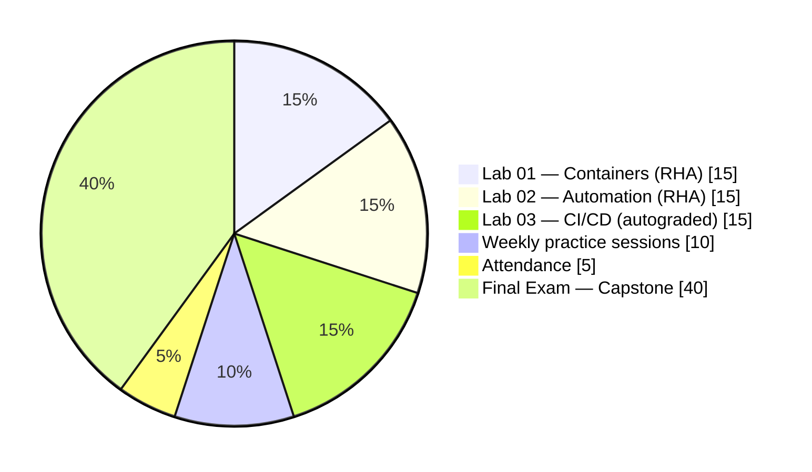

<h1 v-motion :initial="{ x: -60, opacity: 0 }" :enter="{ x: 0, opacity: 1, transition: { duration: 500 } }">
INF 345 — Fundamentals of DevOps
</h1>

<h2 v-motion :initial="{ x: -60, opacity: 0 }" :enter="{ x: 0, opacity: 1, transition: { duration: 500, delay: 150 } }">
Lecture 1: Welcome & The DevOps Landscape
</h2>

Adil Akhmetov · Lesson 1

<!--
No recap for lecture 1 — replace this note block with a 2-3 question recap
of the previous lecture starting from Lecture 2 onward.
-->

---
layout: default
---

# Today's agenda

<v-clicks>

- [ ] What DevOps actually means (not just "the tools")
- [ ] The toolchain map for this entire course
- [ ] How the Red Hat Academy partnership fits in
- [ ] The syllabus — grading & weekly plan
- [ ] How grading works (autograded, fast feedback, no surprise waits)
- [ ] What to do before next lecture

</v-clicks>

---
layout: quote
transition: slide-left
---

# "But it works on my machine."

If you've ever heard this — or said it — you already understand the
problem this entire course exists to solve.

---
layout: section
transition: slide-left
---

# Block 1
## What is DevOps, really?

---
---

# The wall between Dev and Ops

Two teams, opposite incentives, one production system stuck in the middle.
DevOps exists because this wall was a organizational failure, not a
technical one.

---
---

# DevOps is a culture, not a tool — CALMS

<v-clicks>

- **C**ulture — shared ownership, no blame-throwing over the wall
- **A**utomation — humans shouldn't repeat what a script can do reliably
- **L**ean — small batches, fast feedback, cut waste
- **M**easurement — you can't improve what you don't measure
- **S**haring — knowledge and tooling belong to the whole team, not one hero

</v-clicks>

Every tool in this course (Podman, Ansible, GitHub Actions) is an
implementation detail of one or more of these letters — not the point
itself.

---
layout: center
class: text-center
---

# Quick discussion

Where has "it works on my machine" bitten <i>you</i>, 
or someone you know?

(No wrong answers — this is the pain the rest of the semester fixes.)

---
layout: section
transition: slide-left
---

# Block 2
## This course's toolchain

---
---

# The map for this semester

Each box is one module of this course. Nothing here is optional trivia —
each module's lab builds directly on the last one.

---
---

# Why these specific tools

<logos-docker-icon class="text-5xl mx-auto" />
Podman — CLI-compatible with Docker

<logos-ansible class="text-5xl mx-auto" />
Ansible — already fully open-source

<logos-github-icon class="text-5xl mx-auto" />
GitHub Actions — free tier, industry-standard

Rule of thumb for this whole course: whenever a lab uses a Red Hat–specific
tool, the README also tells you the free/open equivalent. Nothing here is
locked to one vendor.

---
---

# Where Red Hat Academy fits in

<v-clicks>

- SDU partners with Red Hat Academy (RHA) — this gives you **free** access
  to official Red Hat cloud labs for two modules: Containers (Podman) and
  Automation (Ansible).
- **Your grade for those two labs comes from finishing the RHA lab itself**
  — your instructor assigns it from the RHA portal, not from a GitHub check.
- These are the same labs used in paid corporate Red Hat training —
  normally not free.
- A few students each year get a shot at a real Red Hat certification
  voucher through this partnership.
- CI/CD isn't covered by RHA at all — that module runs entirely on GitHub,
  which you'd need anyway for literally any software job.

</v-clicks>

---
layout: section
transition: slide-left
---

# Block 3
## How this course runs

---
---

# The syllabus, in one slide

**Course:** INF 345 — Fundamentals of DevOps
**Credits:** 3 cr / 5 ECTS (2 lecture + 1 seminar + 2 lab hrs/week)
**Mode:** Online · **Type:** Elective
**Format:** 15 lessons, lecture + 1h practice each

**Final Exam:** delivered as a Capstone Project + demo
(policy allows a project to substitute for a written exam)
**Full doc:** <code>SYLLABUS.md</code> in the repo root
**Questions:** office hours, or email (see syllabus for etiquette)

Read the full syllabus before Lesson 2 — it has the complete weekly plan,
assessment rubric pointers, and academic integrity policy.

---

# Weekly plan — Fall 2026

| Wk | Topic |
|---|---|
| 1 | Welcome & the DevOps landscape |
| 2 | Git/GitHub workflow & Linux CLI |
| 3 | Containers 101: why & how |
| 4 | Images, layers, multi-stage builds |
| 5 | Container networking & volumes |
| 6 | Container security — **Lab 01 due** |
| 7 | Config management & Ansible basics |
| 8 | Playbooks, roles, variables |

| Wk | Topic |
|---|---|
| 9 | Idempotence & testing (Molecule) |
| 10 | Ansible in production — **Lab 02 due** |
| 11 | CI/CD concepts & GitHub Actions |
| 12 | Building & testing pipelines |
| 13 | Security scanning — **Lab 03 due** |
| 14 | Capstone integration work session |
| 15 | Capstone demos — **Final Exam due** |

Full detail, rubrics, and policies: <code>SYLLABUS.md</code> in the repo.

---

# Grading breakdown

Full detail: <code>SYLLABUS.md</code>.

---
---

# Every lecture has the same shape

<v-clicks>

1. **Recap** — 2-3 quick questions from last time (spaced repetition)
2. **Agenda** — today's roadmap as a checklist, always visible
3. **Hook** — why today's topic actually matters, before any theory
4. **Chunked blocks** — with a real break in between, ending early if we're done
5. **"Before next lecture"** — a concrete, short prep checklist

</v-clicks>

This isn't arbitrary — short chunks, fast feedback, and a predictable
structure just work better for everyone.

---
---

# Fast feedback, not a week of waiting

<v-clicks>

- Fork this repo, do the work, open a Pull Request.
- GitHub Actions runs the autograder → you get a pass/fail/partial
  score **within minutes**.
- No submitting into a void and waiting for grades next week.
- Labs 01 and 02 are the exception — those grades come from Red Hat
  Academy, not GitHub.

</v-clicks>

---
layout: default
---

# Before next lecture

<logos-git-icon class="text-2xl" /><logos-github-icon class="text-2xl" />Lesson 2 is Git & GitHub — come with these ready:

- [ ] Make sure you have a GitHub account
- [ ] Install Docker Desktop **or** Podman Desktop on your laptop
- [ ] Read `SYLLABUS.md` in full

~15-20 min of prep, not a lab.

---
layout: end
---

# See you next lecture

Git & GitHub — the version control workflow every lab in this course runs on.
